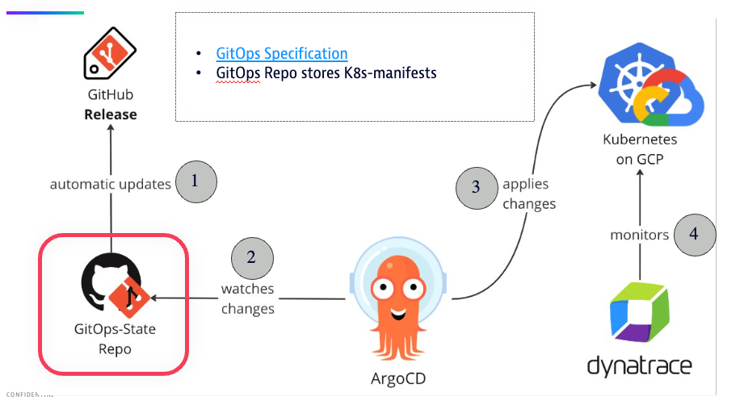

# Cloud Native Software Delivery - UIBK/Dynatrace Tech Visit

<!-- TOC -->

* [Cloud Native Software Delivery - UIBK/Dynatrace Tech Visit](#cloud-native-software-delivery---uibkdynatrace-tech-visit)
* [Workshop Exercises](#workshop-exercises)
  * [1) Continuous Integration](#1-continuous-integration)
    * [1a) Create App Update on Feature-Branches](#1a-create-app-update-on-feature-branches)
    * [1b) Merge to Main to Trigger a Release](#1b-merge-to-main-to-trigger-a-release)
    * [1c) Access your minimal-go-app via exposed Ingress / Swagger UI](#1c-access-your-minimal-go-app-via-exposed-ingress--swagger-ui)
  * [2) Continuous Delivery](#2-continuous-delivery)
    * [2a) Create a new Release and watch CI / CD path to K8s-Cluster](#2a-create-a-new-release-and-watch-ci--cd-path-to-k8s-cluster)
    * [2b) Observe your Deployment on ArgoCD (Logs, Events, etc)](#2b-observe-your-deployment-on-argocd-logs-events-etc)
    * [2c) Scale up your Deployment to be Highly-Available](#2c-scale-up-your-deployment-to-be-highly-available)
  * [3) Observability: Operations and Monitoring with Dynatrace](#3-observability-operations-and-monitoring-with-dynatrace)
<!-- TOC -->

# Workshop Exercises

[](todo)


## 1) Continuous Integration

Semantic Versioning: https://semver.org

Conventional Commits: https://www.conventionalcommits.org

GitHub Flow: https://docs.github.com/en/get-started/using-github/github-flow

### 1a) Create App Update on Feature-Branches


```bash
# checkout new feature-branch
git checkout -b feat/test-release

# change any file and commit with
git commit -m "feat: new release"

# push branch and create PR
git push
```

* check build pipelines on PR and branch

### 1b) Merge to Main to Trigger a Release

* get approve on your PR and merge
* follow build pipeline on main and check released artefacts (Helm-Chart and Container Image)

### 1c) Access your minimal-go-app via exposed Ingress / Swagger UI

```bash
curl https://minimal-go-app-demo.cicd-workshop.at/ # or open via browser
```

## 2) Continuous Delivery

* Open Argo CD https://argocd.cicd-workshop.at/
* and navigate to your
  Application: [ArgoCD minimal-go-app-demo](https://argocd.cicd-workshop.at/applications/argocd/minimal-go-app-demo.minimal-go-app-demo?view=tree&resource=)

### 2a) Create a new Release and watch CI / CD path to K8s-Cluster



### 2b) Observe your Deployment on ArgoCD (Logs, Events, etc)

* Watch Release Updates
* Delete Pod manually
* Trigger OOM via Swagger UI
* Check Pod-Logs / Events

### 2c) Scale up your Deployment to be Highly-Available

* create new release with updated replicas of 3, release again and wait for roll-out:


## 3) Observability: Operations and Monitoring with Dynatrace

...todo...screenshot...
